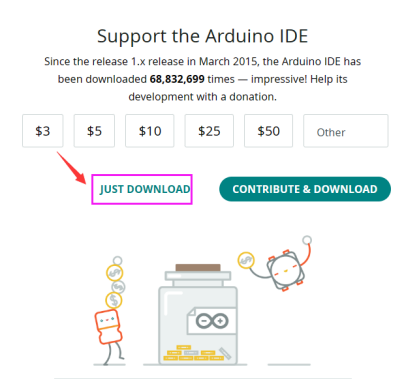
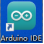
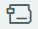
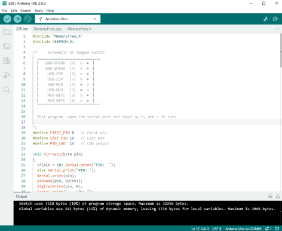
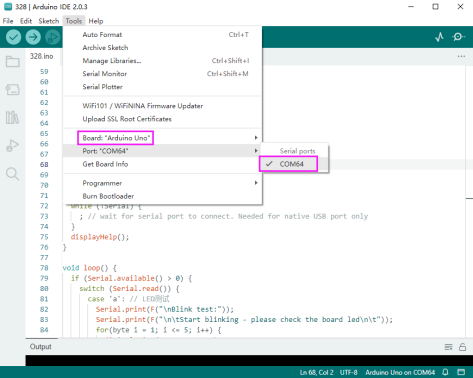
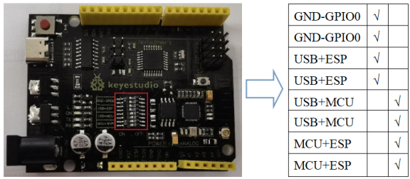
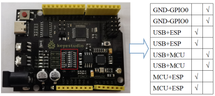
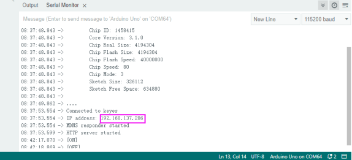
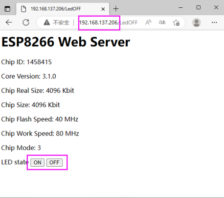

## 1. Introduction 

Keyestudio 328 WIFI PLUS main control board adopts two MCU including ATMEGA328 and esp8266, containing all functions of [Arduino uno](https://store.arduino.cc/products/arduino-mega-2560-rev3)R3 and ESP8266development board.

The download function of the serial port is controlled by the toggle switch, and the codes of the two MCU can be burned separately by using a USB interface so that two development boards can be used alone or combined. It is very convenient when using.

Esp8266+Arduino UNO is suitable for the development of the Internet of Things, networking functions, and independent wireless network construction.

## 2.Parameters 

| Working Voltage               | USB/5VDC/6-9V (Esp8266/3.3V; ATmega328P/5V)                  |
| ----------------------------- | ------------------------------------------------------------ |
| Current                       | Maximum output 3.3V/800mA、5V/800mA                          |
| Maximum Power                 | 4W                                                           |
| Working Temperature Range     | -10~50°C                                                     |
| Dimensions                    | 68.5*53.5*13mm                                               |
| Environmental Attributes      | ROHS                                                         |
| ATmega328P Digital I/O Pin    | 14pin (6 for PWM output)                                     |
| ATmega328P PWM Digital I/O    | 6pin                                                         |
| ATmega328P Analog Input Pin   | 8pin (A4,A5 as regular I2C)                                  |
| DC of each ATmega328P I/O Pin | 20mA                                                         |
| ATmega328P flash              | 32KB (ATmega328P), 0.5KB used for bootloader)                |
| ATmega328P SRAM               | 2KB(ATmega328P)                                              |
| ATmega328P EEPROM             | 1KB(ATmega328P)                                              |
| ATmega328P Clock Speed        | 16MHZ                                                        |
| Esp8266  Digital I/O Pin      | 9 on-board pins                                              |
| Esp8266  PWM Digital I/O      | 4pin（IO4, IO12, IO14, IO15）                                |
| DC of each Esp8266 I/O Pin    | 20mA                                                         |
| Esp8266   flash               | 2Mb                                                          |
| Esp8266  SRAM                 | 50kb                                                         |
| Esp8266Clock Speed            | 26MHZ                                                        |
| Esp8266Radio Frequency        | 2.4GHZ Receiver and Transmitter                              |
| Wifi                          | ESP8266EX supports TCP/IP protocol and 802.11 b/g/n WLAN MAC protocol. Supports Basic Service Set (BSS) STA and SoftAP operation under Distributed Control Function (DCF).Enables optimization of active hours by minimizing host interaction for power management. |

# 3. Interfaces and Components Description 

# 4. Special Function Interface 

Serial Communication: D0(RX), D1(TX)

PWM Interface (Pulse Width Modulation): D3 D5 D6 D9 D10 D11

External Interrupt: D2(Interrupt 0) and D3 (Interrupt 1)

SPI Communication：D10(SS), D11(MOSI), D12(MISO), D13(SCK)

IIC Communication：A4(SDA), A5(SCL)

ESP8266 Pin

| Logo of the board as the positive direction,pin attributes from left to right |        |       |
| ------------------------------------------------------------ | ------ | ----- |
| GPIO4                                                        | TX0    | GND   |
| GPIO2                                                        | GPIO12 | GPIO0 |
| CH-P0                                                        | GPIO16 | RX0   |
| RST                                                          | VCC    | TOUT  |

DIP Switch Description (ON/OFF)

|           |     |     |                                                          |
|-----------|-----|-----|----------------------------------------------------------|
| Mark      | ON  | OFF | Function                                                 |
| GND-GPIO0 | √   |     | The GPIO0 of ESP8266 connects to GND                     |
| GND-GPIO0 | √   |     |                                                          |
| USB-\>ESP | √   |     | USB and serial communication of ESP8266 is opened        |
| USB-\>ESP | √   |     |                                                          |
| USB-\>MCU | √   |     | USB and serial communication of ATmega328P is opened     |
| USB-\>MCU | √   |     |                                                          |
| MCU-\>ESP | √   |     | ESP8266 and serial communication of ATmega328P is opened |
| MCU-\>ESP | √   |     |                                                          |

# 5.Detailed Usage for Windows System 

### 5.1 Install Arduino IDE

We need to download and install Arduino IDE when we get this control board.

You may click here to download Arduino IDE：

<https://www.arduino.cc/>

Click  as follows:

Please choose Arduino IDE 2.0.3.

Click  for download this file(.exe) automatically and need to install manually.

Click  for download Arduino IDE 2.0.3, which is a zipped file. Unzip it for use without installation.

Click “JUST DOWNLOAD” to directly install Arduino IDE.

Normally, we just need to click JUST DOWNLOAD for download. If you like, of cause, you may also choose to contribute and download for assisting open source business of ARDUINO.

### 5.2 Install a driver 

If you have installed the CH340 driver, just skip it.

Connect the main control board to your computer with a USB cable, and the driver will be installed automatically on MacOS and Windows10 system. If the driver installation process fails, you need to install the driver manually.

①Check whether the computer automatically installs the driver:

Right click Computer----- Click Properties-----Click Device Manager, the following picture shows the successful installation:

②Manual installation:  

Right-click “**USB2.0-Serial**” and click “**Update drive...**”

Click “**Browse my computer for driver software**”

Click“**Browse...**”and select the“**usb_ch341_3.1.2009.06 folder**”.

Check the serial port connection status again, as shown in the following figure, the driver is successfully installed.

> 

### **5.3** Arduino IDE Install ESP8266

Connect this board to your computer with a USB cable and find  to enter IDE.

Click File → Preferences and copy this address: <http://arduino.esp8266.com/stable/package_esp8266com_index.json>

to “Additional Boards Manager URLs:”and click OK to save this address.

Click  to enter Boards Manager, and IDE will download corresponding files automatically. Input 8266 in the space after “All”. Then click the “Search” and “Install” to start installing the relevant plug-ins, as follows:

Click Tools→Board: after successful installation, and you may find  in it.

### **5.4 Arduino IDE Setting and Toolbar Introduction**

The function of each symbol in the Arduino IDE toolbar:

 Checking compilation errors

 Uploading programs to Arduino boards

 Single-step debugging when writing a program

 Receiving serial data from the board and sending the data to the board's serial monitor

 Converting the data received by the serial port into dynamic graphs

 Opening the latest saved example sketch

 Manually installing the development board

To avoid any errors while uploading programs to the board, we must choose the correct **Arduino board name and COM port** which matches the board connected to your computer.

Shift to Tools→Board, and choose your board.

328 WIFI PLUS main control board is able to used as and. When uploading the programs, please toggle the DIP switch. For details, please refer to (7，Projects)

The COM port of the main control board could be checked at Device Manager of your computer (You will see the corresponding COM port after the driver is successfully installed).

# 6、Detailed Usage for MAC System 

## 6.1Download and Install Arduino IDE

Different Arduino IDE is need for different system, and the download method is similar to Chapter 5.1.

## 6.2 Install Drive Files

Please refer to the following link:

<https://wiki.keyestudio.com/Download_CH340_Driver_on_MAC_System>

## 6.3 Arduino IDE Settings

The setting of Arduino IDE is similar to Chapter 5.3; The only difference is COM port:

# 7. Projects 

### 7.1 Arduino UNO Burn Test Program: 

①Connect PLUS main control board to computer with USB cable. Taking Keyestudio LOGO as a reference, toggle the switch to the left(ON) and right(OFF).

The positions of the DIP switch are shown below:

②Open  under code 328

Choose the development board and port.

③ Click  to upload the program to PLUS main control board, and wait for a prompt of successful uploading in the lower left corner. Then click  to open the watch window and set baud rate at 115200; sequentially send:

a: lighting test (D13)

b: memory test

c: pin test

### 7.2 ESP8266 Burn Test Program:

①Connect PLUS main control board to computer with USB cable. Taking Keyestudio LOGO as a reference, toggle the switch to the left(ON) and right(OFF).

The positions of the DIP switch are shown below:

② Openunder code esp8266, and turn on the WIFI network sharing of the mobile phone or computer and set the name and password to be consistent with those in the program.

Choose the development board  and port.

③Click  to upload the program to PLUS main control board, and wait for a prompt of successful uploading in the lower left corner. If the upload fails, unplug the USB cable and reconnect it before uploading.

NOTE: Before each programming of esp8266, the switch must be toggled at GND-GPIO0, and it can also be used as a normal IO port if turn it off after programming.

④Test result:

The positions of DIP switch are shown below:

Clickto open the watch window and set baud rate at 115200. After the ESP8266 of the main control board is connected to WIFI, the IP address will be displayed on the monitoring serial port (Press RESERT button if not).

### 7.3 TEST_UNO-ESP Remote Control

①Upload the project on Chapter 7.2, and choose the development board when uploading.

②Uploadto the main control board and choose the development board. For detailed operation please refer to Chapter 7.1.

③ After successful uploading. Toggle the switch to the position shown below:

④ Open Hotpot and connect ESP8266 to WIFI network. And open the serial port after successful connecting, IP address will be displayed. Open this address of 8266 on any browser, the \[ON\] \[OFF\] switch of LED state is able to control the onboard LED on the main control board.

