# **Keyestudio 328 WIFI PLUS主控板 黑色环保**

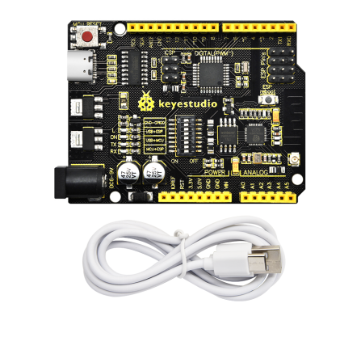

## 1.概述 

Keyestudio 328 WIFI PLUS主控板由ATMEGA328和esp8266两个MCU组合设计，具有[Arduino uno](https://store.arduino.cc/products/arduino-mega-2560-rev3)R3和ESP8266开发板的所有功能，通过拨动开关控制串口下载功能，使用一个usb接口即可分别给两个MCU烧录代码，实现两个开发板单独使用，也可以组合一起使用，非常方便。Esp8266+Arduino UNO适用于物联网开发，可以添加联网功能，也可以构建独立的无线网络。

# 2、规格参数 

| 电压                             | USB/5V、DC/6-9V（其中Esp8266/3.3V、ATmega328P/5V）           |
| -------------------------------- | ------------------------------------------------------------ |
| 电流                             | 最大输出3.3V/800mA、5V/800mA                                 |
| 最大功率                         | 最大输出4W                                                   |
| 工作温度范围                     | -10~50摄氏度                                                 |
| 尺寸                             | 68.5*53.5*13mm                                               |
| 环保属性                         | ROHS                                                         |
| ATmega328P 数字I/O引脚           | 14个（其中6个提供PWM输出）                                   |
| ATmega328P PWM数字I/O            | 6个                                                          |
| ATmega328P 模拟输入引脚          | 8个（其中A4,A5作为固定I2C）                                  |
| ATmega328P 每个I/O引脚的直流电流 | 20mA                                                         |
| ATmega328P flash                 | 32KB(ATmega328P)其中0.5KB由引导加载程序使用                  |
| ATmega328P SRAM                  | 2KB(ATmega328P)                                              |
| ATmega328P EEPROM                | 1KB(ATmega328P)                                              |
| ATmega328P 时钟速度              | 16MHZ                                                        |
| Esp8266   数字I/O引脚            | 板载9个                                                      |
| Esp8266  PWM数字I/O              | 4个（IO4,IO12,IO14,IO15）                                    |
| Esp8266 每个I/O引脚的直流电流    | 20mA                                                         |
| Esp8266   flash                  | 2Mb                                                          |
| Esp8266  SRAM                    | 50kb                                                         |
| Esp8266   时钟速度               | 26MHZ                                                        |
| Esp8266   射频                   | 2.4GHZ接收器与发射器                                         |
| Wifi                             | ESP8266EX 支持 TCP/IP 协议，完全遵循 802.11 b/g/n WLAN MAC 协议，支持分布式控 制功能 (DCF) 下的基本服务集 (BSS) STA 和 SoftAP 操作。支持通过最小化主机交互来优化有效工作时⻓，以实现功耗管理。 |

# 3.各个接口和主要元件说明 

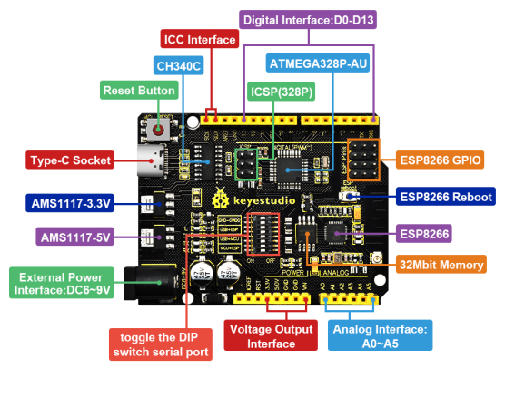

# 4.特殊功能接口说明 

串口通信接口：D0为RX、D1为TX

PWM接口（脉宽调制）：D3 D5 D6 D9 D10 D11

外部中断接口：D2(中断0)和D3 (中断1)

SPI通信接口：D10为SS、D11为MOSI、D12为MISO、D13为SCK

IIC通信端口：A4为SDA、A5为SCL

ESP8266引脚

|                                          |        |       |
|------------------------------------------|--------|-------|
| 以板子的Logo为正方向，从左到右的引脚属性 |        |       |
| GPIO4                                    | TX0    | GND   |
| GPIO2                                    | GPIO12 | GPIO0 |
| CH-P0                                    | GPIO16 | RX0   |
| RST                                      | VCC    | TOUT  |

拨码开关说明(ON打开，OFF关闭)

|           |     |     |                                   |
|-----------|-----|-----|-----------------------------------|
| 标识      | ON  | OFF | 功能                              |
| GND-GPIO0 | √   |     | ESP8266的GPIO0与GND连接           |
| GND-GPIO0 | √   |     |                                   |
| USB-\>ESP | √   |     | USB与ESP8266的串口通信打开        |
| USB-\>ESP | √   |     |                                   |
| USB-\>MCU | √   |     | USB与ATmega328P的串口通信打开     |
| USB-\>MCU | √   |     |                                   |
| MCU-\>ESP | √   |     | ESP8266与ATmega328P的串口通信打开 |
| MCU-\>ESP | √   |     |                                   |

# 5.在Windows系统电脑详细使用方法 

### 5.1安装Arduino IDE

拿到这个控制板后，我们首先需要下载安装Arduino IDE。

你可以进入以下网址下载Arduino IDE：<https://www.arduino.cc/>，点击显示如下图。

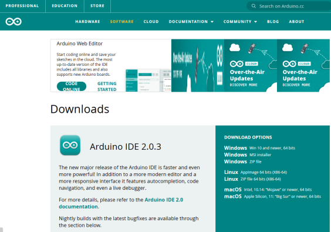

我们这里选择安装2.0.3版本Arduino IDE，当我们点击，代表下载安装文件(.exe) ，需要手动安装。当我们点击，代表直接下载2.0.3版本Arduino IDE，是一个压缩文件，解压就可以使用，无需安装。

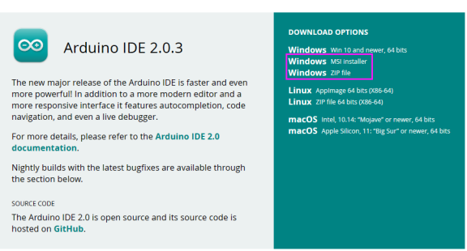

点击下面图标，就可直接安装Arduino IDE了。

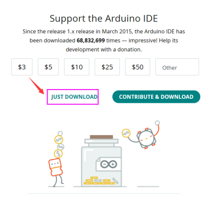

一般情况下，我们点击JUST DOWNLOAD就可以下载了，当然如果你愿意，你可以选择小小的赞助，以帮助伟大的ARDUINO 开源事业。

### 5.2安装驱动：

（注意：如果电脑已经安装了CH340驱动程序，则不需要再安装驱动；如果没有，则需要进行以下操作）

将主控板用USB线连接在电脑上，一般MacOS和Windows10系统的电脑会自动安装驱动。如果没能自动安装，则需要手动安装驱动。

（1）查看电脑是否自动安装好驱动：

点击“计算机”--“属性”--“设备管理器”，显示如下图是安装成功的了：

（2）如果没能自动安装，那就手动安装，步骤如下：

右键点击“USB Serial”，选择“更新驱动程序(P)”并点击。

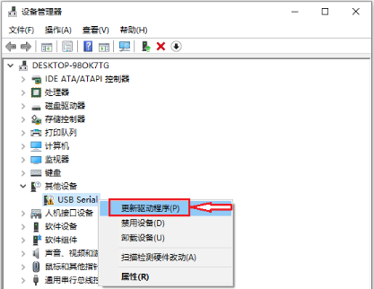

跳转到以下页面，选择“浏览我的电脑以查找驱动程序(R)”并点击。

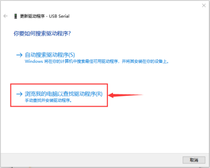

点击“浏览(R)...”选择我们提供的资料中的驱动文件夹，如下图

“usb_ch341_3.1.2009.06 folder”。

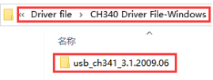

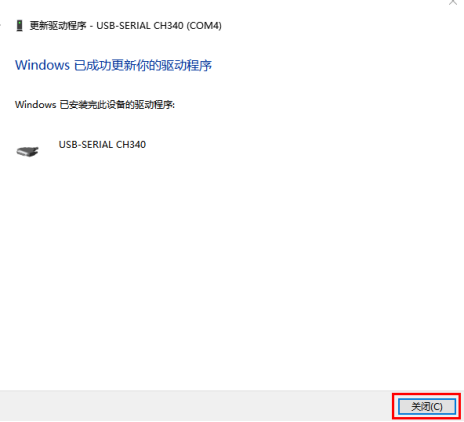

再次查看串口连接状态，如下图，则是成功安装驱动

> 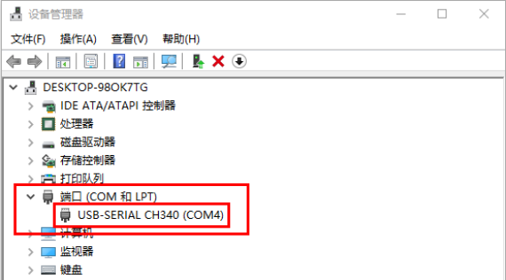

### **5.3** Arduino IDE安装ESP8266

将控制板用USB线连接到电脑，找到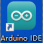图标点击进入IDE界面。

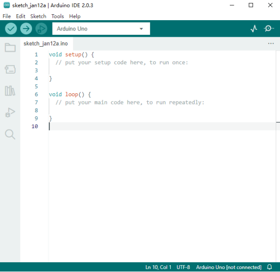

点击File →Preferences复制这个地址：

<http://arduino.esp8266.com/stable/package_esp8266com_index.json>

到“Additional Boards Manager URLs:”中然后点击ok保存这个地址。

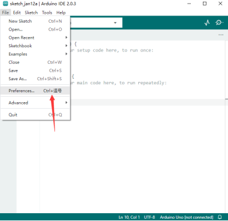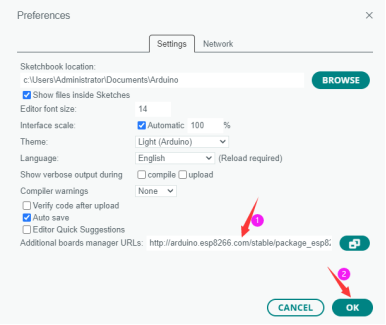

点击进入Boards Manager，IDE会自动下载相关文件，在All后空格中输入8266，然点击下面搜索内容，点击Install开始安装相关插件，如下图。

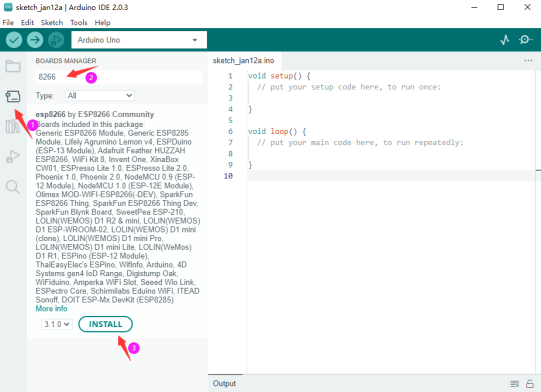

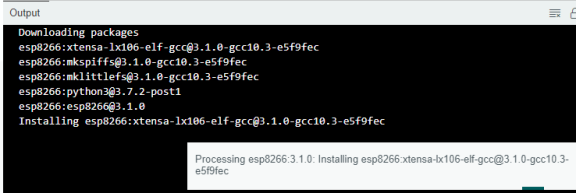

安装成功后，点击Tools→Board:，你可以在里面找到。

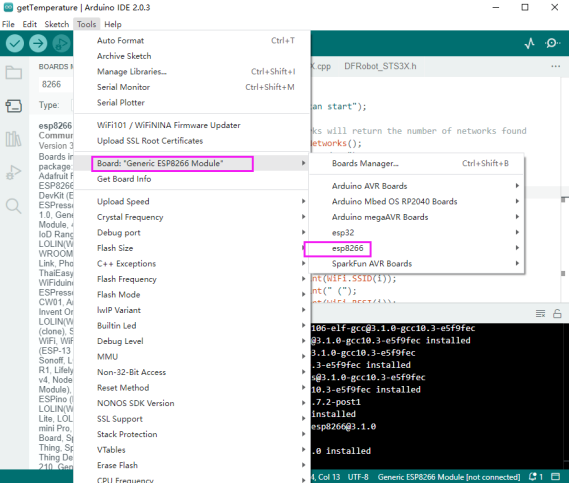

### **5.4 Arduino IDE设置和工具栏介绍**

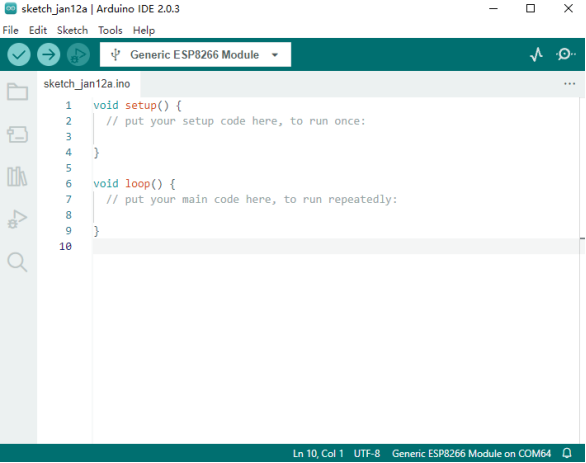

Arduino IDE工具栏中出现的每个符号的功能:

 用于检查是否存在任何编译错误。

 用于将程序上传到Arduino板。

 用于编写程序时的单步调试。

 用于从板接收串行数据并将串行数据发送到板的串行监视器。

 用于串口接收的数据转换成动态曲线图。

 用于打开最近保存的示例草图。

 用手动安装开发板。

为了避免在将程序上载到板上时出现任何错误，必须选择正确的**Arduino板名称和COM口**，该名称与连接到计算机的电路板相匹配。转到Tools→Board，然后选择你的板。

328 WIFI PLUS主控板可当和使用，上传程序时要用板载的拨码开关切换，使用详情参考（7，案例程序)

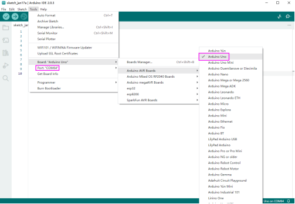

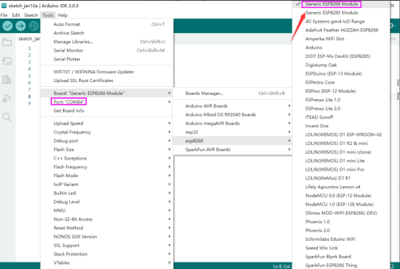

主控板的COM口可以在电脑的设备管理器中看到（安装驱动成功后可看到对应COM口）。

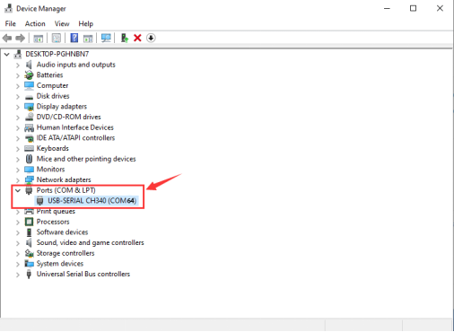

# 6、在MAC系统电脑详细使用方法

## 6.1下载安装Arduino IDE

不同的系统，需要下载不同的Arduino IDE，下载方式和5.1章节类似。选择如下图。

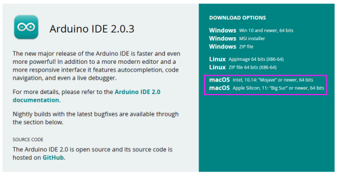

## 6.2安装驱动文件

Please refer to the following link:

[*https://wiki.keyestudio.com/Download_CH340_Driver_on_MAC_System*](https://wiki.keyestudio.com/Download_CH340_Driver_on_MAC_System)

## 6.3 Arduino IDE设置

在 Arduino IDE设置时，方法和5.3章节类似，只是设置COM口时不同，如下图。

> 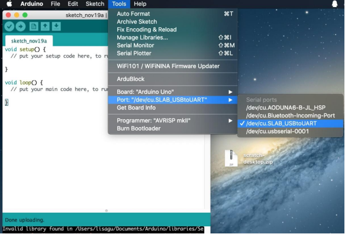

# **7.案例**

### 7.1 Arduino UNO烧录测试程序：

①用USB线连接好PLUS主控板，以KeyestudioLOGO为参照物，拨动开关往左为打开，右为关闭，拨码开关位置如下图。

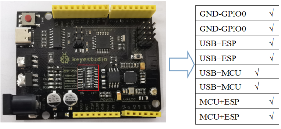

②打开目录code 328下的程序

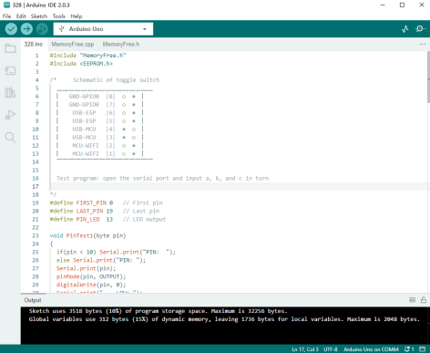

选择好开发板和端口

③点击上传程序到PlUS主控板，上传成功后左下角会有提示，然后点击打开监视窗口设计波特率为115200，依次发送 a: 点灯测试（D13)

b: 内存测试。

c: 引脚测试。

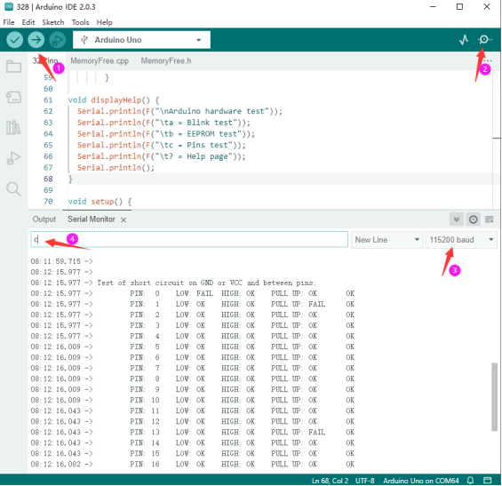

### 7.2 ESP8266烧录测试代程序：

①用USB线连接好PLUS主控板，以KeyestudioLOGO为参照物，拨动开关往左为打开，右为关闭，拨码开关位置如下图。

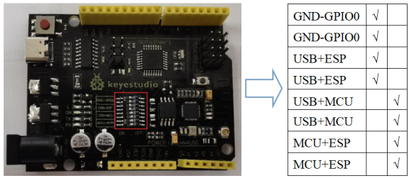

②打开目录code esp8266下的，打开手机或者电脑的wifi网络共享并设置名称、密码和程序中的一致

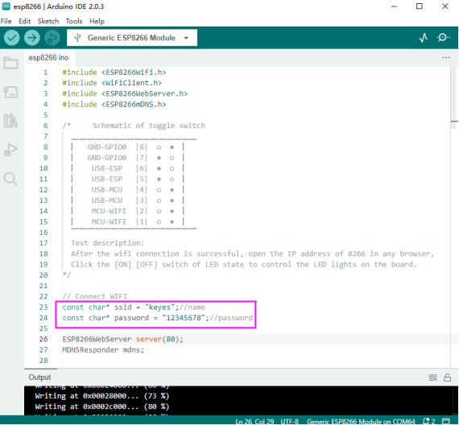

选择好开发板和端口

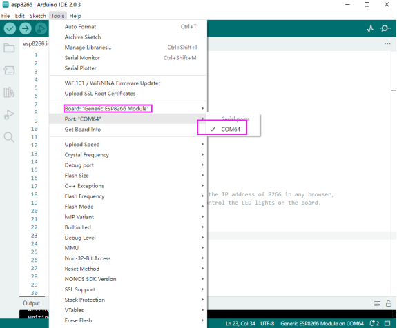

③点击上传程序到PlUS主控板，上传成功后左下角会有提示，若出现无法上传的情况拔掉USB线重新连接再上传。

注意：esp8266每次烧录前，拨动开关必须把GND-GPIO0打开，烧录完后再关闭，可做正常IO口用。

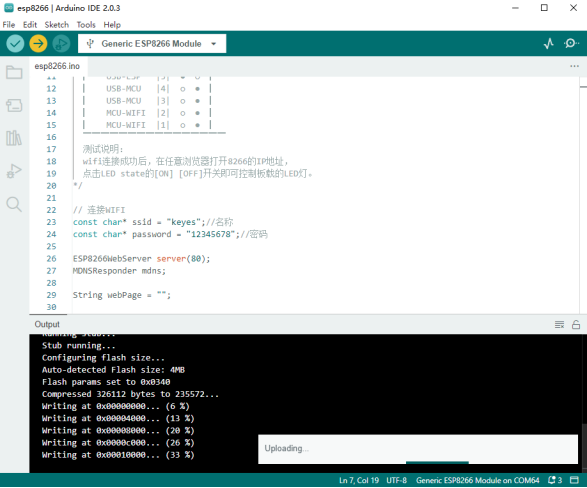

④实验结果：上传程序到主控板后，拨动拨码开关位置如下图，点击打开监视窗口设计波特率为115200，主控板的ESP8266连接上wifi后在监视串口上打印出IP地址（没有显示时按一下板子上的复位按键)

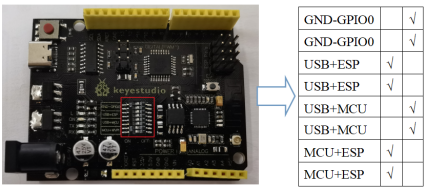

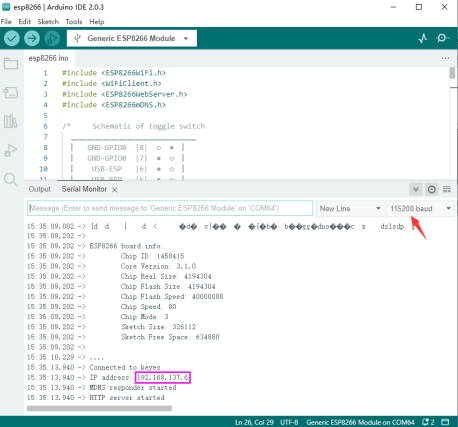

### 7.3TEST_UNO-ESP远程操控

①上传7.2章节的例程程序,上传时选择开发板型号：

②上传程序到主控板时选择开发板型号，具体上传操作可参考7.1章节

③程序上传成功后，拨码开关拨到如下图位置

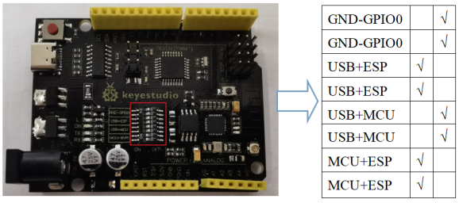

④打开热点，让ESP8266连接到wifi网络。连接成功后打开串口，会显示IP地址，在任意浏览器打开8266的IP地址，点击LED state的\[ON\] \[OFF\]开关，即可控制主控板的板载的LED灯。

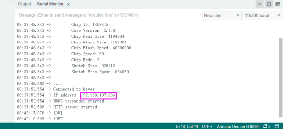

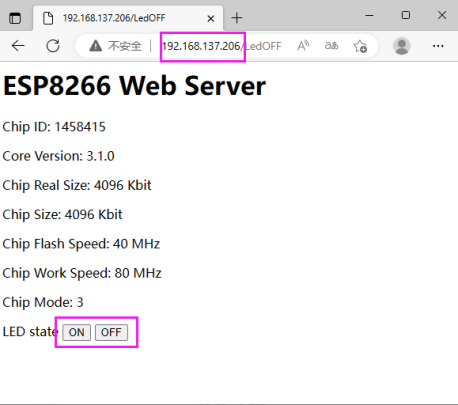
